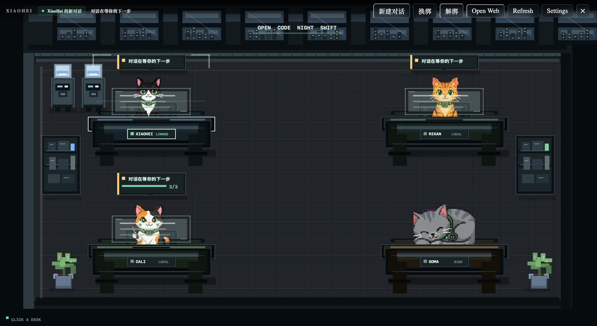

# opencode-pet



---

## 中文

一个本地优先的 OpenCode 桌面猫猫伙伴。

_多猫办公室视图：每只猫绑定一个 OpenCode 对话，在同一个桌面里查看状态、todo 进度和嵌入式 OpenCode Web。_

opencode-pet 把 OpenCode 的本地数据变成一个更轻量、更常驻桌面的界面。它会读取你机器上的 OpenCode SQLite 数据和本地 OpenCode server，把每只猫绑定到一个具体 session，用悬浮层、办公室视图和状态气泡帮你持续跟进任务，而不是频繁切回终端或网页。

### 它适合做什么

- 想同时盯多个 OpenCode 对话，但不想一直切窗口。
- 想把“哪只猫在跟哪件事”固定下来，降低上下文切换成本。
- 想快速看到 todo、最近状态和是否在等你下一步。
- 想保留本地优先的工作流，不把项目内容默认发到云端。

### 功能亮点

- 一猫一对话：每只猫可以独立绑定一个 OpenCode session，互不打扰。
- Compact 悬浮层：桌面默认只显示第一只猫，信息够用但不吵。
- 猫猫办公室：集中查看所有桌子、绑定状态、todo 进度和关注项。
- 嵌入式 OpenCode Web：已绑定 session 可以分栏打开，也可以切到更聚焦的视图。
- 新建并绑定：可以直接给某只猫新建一个 session，并立刻接管跟踪。
- 本地摘要：状态气泡优先走快速规则，更完整的摘要在后台缓存和限频生成。
- 本地优先：读取本地 SQLite 和本地 server，默认不依赖云端摘要 provider。

### 工作方式

opencode-pet 主要依赖两类本地输入：

- OpenCode SQLite：读取 session、message、todo 等历史状态。
- OpenCode server：提供实时事件、OpenCode Web 和更及时的会话对齐信息。

应用会自动扫描常见的 `.opencode` 目录，也支持在 Settings 里手动指定数据库路径。数据库以只读方式访问；更高频的实时状态则来自本地 server。

### 快速开始

#### 环境要求

- Node.js 20+
- pnpm 10+
- Rust stable toolchain
- 已安装 OpenCode，并且至少运行过一次，让本机存在 `.opencode` 数据

#### 1. 安装依赖

```bash
pnpm install
```

#### 2. 启动本地 OpenCode server

默认端口是 `4096`：

```bash
opencode serve --port 4096
```

如果你使用其他端口，稍后可以在 Settings 里把 OpenCode Server URL 改成对应地址。

#### 3. 启动桌面应用

```bash
pnpm tauri dev
```

首次进入后，应用会自动扫描常见的 `.opencode` 目录；如果没有找到合适数据库，可以在 Settings 里手动选择。

### 开发命令

只启动前端预览：

```bash
pnpm dev
```

前端构建和类型检查：

```bash
pnpm build
```

Rust 后端检查：

```bash
cd src-tauri
cargo check
```

构建生产版本：

```bash
pnpm tauri build
```

### 本地摘要

opencode-pet 有两层摘要机制：

- 实时气泡：优先追求快、稳定、省资源，主要来自 todo、最近消息和 OpenCode 事件。
- 后台 session 摘要：在消息或 todo 变化后生成，带 fingerprint 缓存和限频机制。

如果本地 AI provider 不可用，应用会自动退回确定性的规则摘要，不会因为摘要失败阻塞主流程。

支持的本地摘要 endpoint：

- Ollama：`http://127.0.0.1:11434`
- OpenAI-compatible 本地服务：`http://127.0.0.1:1234/v1`

可选环境变量：

```bash
OPENCODE_PET_OLLAMA_URL=http://127.0.0.1:11434
OPENCODE_PET_SUMMARY_BASE_URL=http://127.0.0.1:1234/v1
OPENCODE_PET_SUMMARY_MODEL=qwen2.5-coder
```

只接受 `localhost` 和 `127.0.0.1` 这一类本地 endpoint。远程摘要地址会被拒绝，这是刻意的产品边界。

### 平台支持

目前主要面向：

- macOS
- Linux

Windows 暂时没有充分实测，所以还不标为正式支持平台。

### 隐私与本地优先

opencode-pet 读取的是本机 OpenCode SQLite 和本地 OpenCode server 响应。默认设计目标是：让状态可见，但尽量不把项目上下文送到远程服务。

不要提交这些内容：

- `.opencode` 数据库
- 包含私有项目上下文的日志、截图、录屏
- 本地 settings、API key、真实环境变量
- 未清理的生成素材

### 常见问题

#### `pnpm tauri dev` 提示 `Port 1420 is already in use`

说明已经有一个 Vite dev server 在运行。关掉旧进程后重新启动即可。

#### 看不到对话或 session 列表为空

先确认目标项目里运行过 OpenCode，并在 Settings 里检查当前选中的 `.opencode` 数据库是否正确。

#### OpenCode Web 能打开，但 session 对不上

确认 OpenCode server 正在使用 Settings 里配置的同一个端口，并且当前绑定的 session 确实存在于那个 server 上。

#### 摘要没有走本地模型

先检查本地 provider 是否已经启动，再确认环境变量是否指向 `localhost` 地址。没有可用 provider 时，应用会自动退回规则摘要。

### 资源与素材

猫猫资源是项目自有或为本项目生成、处理的素材。详见 [public/pets/ATTRIBUTION.md](public/pets/ATTRIBUTION.md)。

### 贡献

欢迎提 issue 和 PR。开发约定、提交流程和素材说明见 [CONTRIBUTING.md](CONTRIBUTING.md)。

### 许可证

MIT。详见 [LICENSE](LICENSE)。

---

## English

A local-first desktop cat companion for OpenCode sessions.

_Multi-cat office view: each cat is bound to one OpenCode session, so you can track status, todo progress, and the embedded OpenCode Web UI from a single desktop scene._

opencode-pet turns local OpenCode state into a lightweight desktop companion. It reads your local OpenCode SQLite data and local OpenCode server, binds each cat to a specific session, and keeps progress visible through a floating overlay, an office view, and compact status bubbles, so you do not need to keep jumping back to a terminal or browser tab.

### What It Is Good For

- Watching multiple OpenCode sessions without constantly switching windows.
- Keeping a stable mapping between cats and tasks to reduce context switching.
- Quickly seeing todos, recent activity, and whether a session is waiting on you.
- Staying local-first instead of sending project context to cloud services by default.

### Highlights

- One cat, one session: each cat can track its own OpenCode session independently.
- Compact overlay: the default floating layer shows only the first cat, so the desktop stays calm.
- Cat office: review desks, bindings, todo progress, and attention items in one place.
- Embedded OpenCode Web: bound sessions can open in a docked layout or a more focused view.
- Create and bind: start a new session for a specific cat and immediately let it track that work.
- Local summaries: fast status bubbles use lightweight rules first, while richer summaries are cached and rate-limited in the background.
- Local-first by design: reads local SQLite state and a local server, without depending on cloud summary providers.

### How It Works

opencode-pet mainly depends on two local inputs:

- OpenCode SQLite: reads session, message, and todo history.
- OpenCode server: provides realtime events, OpenCode Web, and more up-to-date session alignment.

The app automatically scans common `.opencode` directories and also lets you choose a database manually in Settings. Databases are accessed read-only, while higher-frequency updates come from the local server.

### Quick Start

#### Requirements

- Node.js 20+
- pnpm 10+
- Rust stable toolchain
- OpenCode installed and run at least once so local `.opencode` data exists

#### 1. Install dependencies

```bash
pnpm install
```

#### 2. Start a local OpenCode server

The default port is `4096`:

```bash
opencode serve --port 4096
```

If you use a different port, update the OpenCode Server URL in Settings later.

#### 3. Launch the desktop app

```bash
pnpm tauri dev
```

On first launch, the app scans common `.opencode` directories automatically. If it does not find the right database, you can choose one manually in Settings.

### Development Commands

Frontend preview only:

```bash
pnpm dev
```

Frontend build and type check:

```bash
pnpm build
```

Rust backend check:

```bash
cd src-tauri
cargo check
```

Production build:

```bash
pnpm tauri build
```

### Local Summaries

opencode-pet uses two summary layers:

- Realtime bubbles: optimized for speed, stability, and low overhead, mainly based on todos, recent messages, and OpenCode events.
- Background session summaries: generated after message or todo changes, with fingerprint-based caching and rate limiting.

If no local AI provider is available, the app automatically falls back to deterministic rule-based summaries, so summary generation never blocks the main workflow.

Supported local summary endpoints:

- Ollama: `http://127.0.0.1:11434`
- OpenAI-compatible local service: `http://127.0.0.1:1234/v1`

Optional environment variables:

```bash
OPENCODE_PET_OLLAMA_URL=http://127.0.0.1:11434
OPENCODE_PET_SUMMARY_BASE_URL=http://127.0.0.1:1234/v1
OPENCODE_PET_SUMMARY_MODEL=qwen2.5-coder
```

Only `localhost` and `127.0.0.1` endpoints are accepted. Remote summary endpoints are intentionally rejected.

### Platform Support

Currently targeted at:

- macOS
- Linux

Windows has not been tested enough yet, so it is not marked as officially supported.

### Privacy and Local-First Behavior

opencode-pet reads local OpenCode SQLite data and responses from a local OpenCode server. The product goal is to keep state visible while avoiding remote transmission of project context by default.

Do not commit:

- `.opencode` databases
- Logs, screenshots, or recordings containing private project context
- Local settings, API keys, or real environment variables
- Uncleared generated assets

### FAQ

#### `pnpm tauri dev` says `Port 1420 is already in use`

That usually means another Vite dev server is already running. Stop the old process and try again.

#### I cannot see sessions or the session list is empty

Make sure OpenCode has been run in the target project, then check that the selected `.opencode` database in Settings is the correct one.

#### OpenCode Web opens, but the session does not match

Make sure the OpenCode server is running on the same port configured in Settings, and that the currently bound session actually exists on that server.

#### The app is not using my local model for summaries

Check that your local provider is running and that the configured environment variables still point to a `localhost` endpoint. If no provider is available, the app falls back to rule-based summaries automatically.

### Assets

Cat assets are original or project-specific generated and processed resources for this app. See [public/pets/ATTRIBUTION.md](public/pets/ATTRIBUTION.md) for details.

### Contributing

Issues and pull requests are welcome. For development conventions, workflow notes, and asset guidance, see [CONTRIBUTING.md](CONTRIBUTING.md).

### License

MIT. See [LICENSE](LICENSE).
